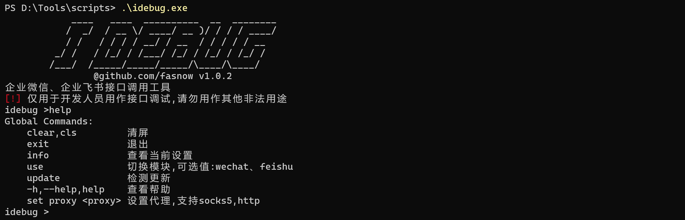
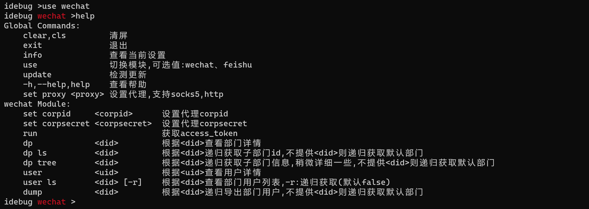
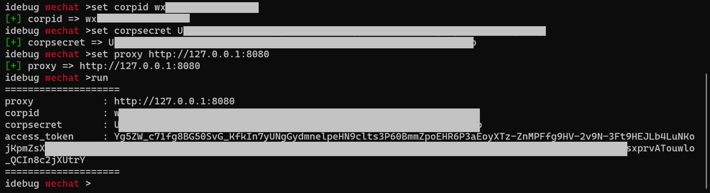
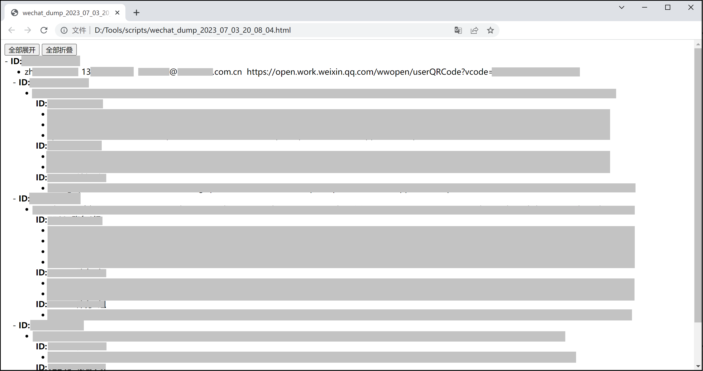
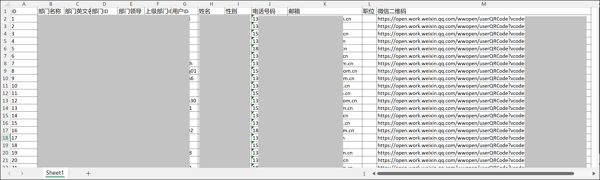
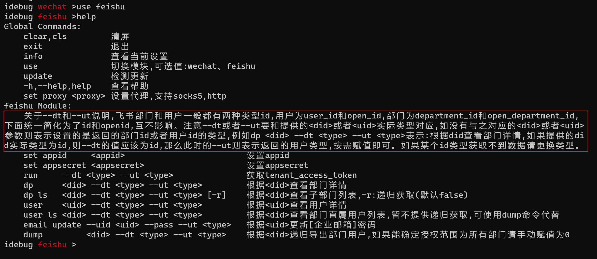
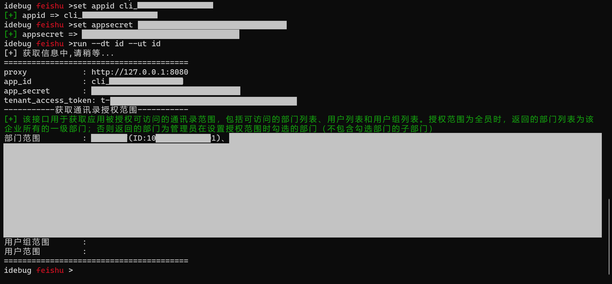
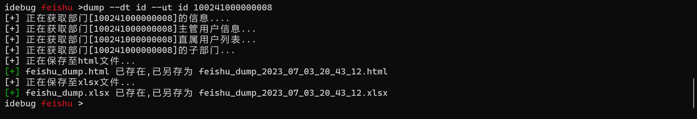
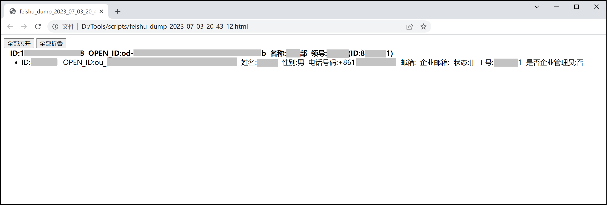
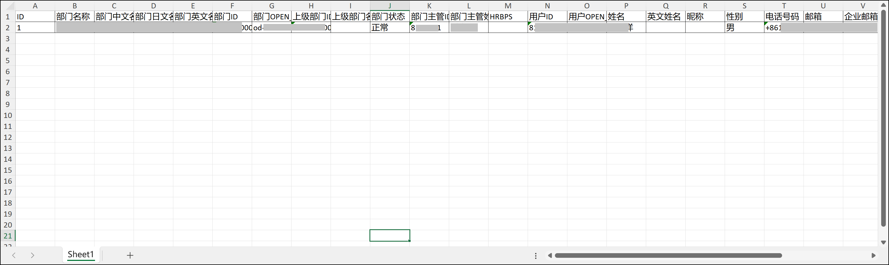

# idebug

## 简介

企业微信、企业飞书接口调用工具。

**仅用于开发人员用作接口调试,请勿用作其他非法用途。**

## 更新内容

**2023.07.07 v1.0.2** 

1. 添加了企业飞书接口调用；

**2023.06.09 v1.0.1** 

1.  取消了access_token权限查询功能，权限查询接口现在需要登陆且只能查询登录企业的access_token。

**2023.06.07 v1.0.0** 

1.  支持企业微信接口调用。

## 使用方法

**`wechat`模块**

使用`use wechat  ` 选择模块。

首先设置`corpid`和`corpsecret`，如有需要可以设置代理，之后再执行`run`命令。

导出通信录，不提供部门id的话则会获取全量信息。

其他命令请自行查看使用方法。测试用到的`key`比较少，可能存在未知问题。

**`feishu`模块**

使用`use feishu  ` 选择模块，注意红色方框里的说明。

设置认证信息后执行。

导出通信录，不提供部门id的话会获取所有的授权访问部门信息，如果能确定部门权限为全部门，请手动赋值部门id为0，不然获取到的用户信息可能不全。

其他命令请自行查看使用方法。测试用到的`key`比较少，可能存在未知问题。

## TODO

？？？

