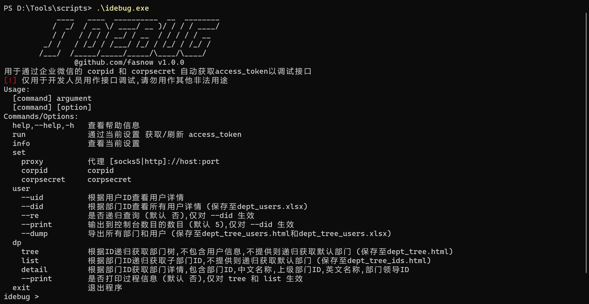
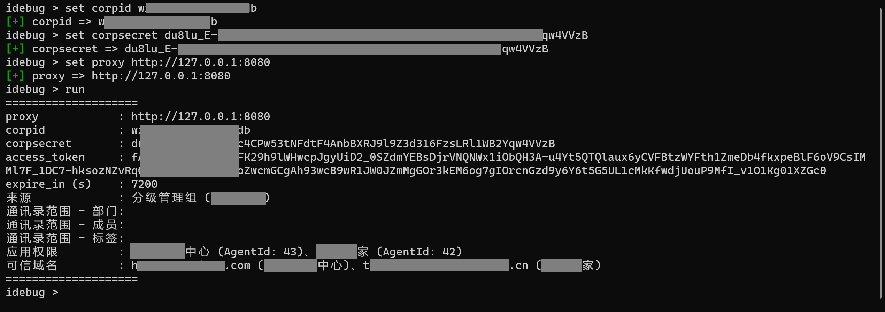
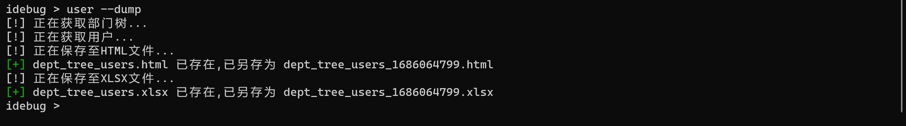
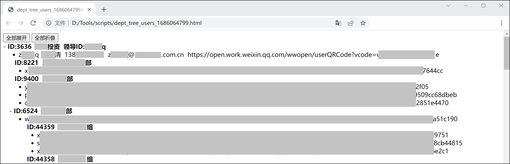
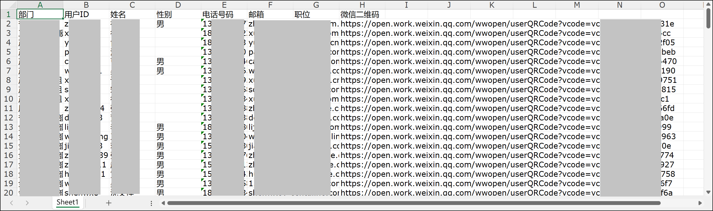

# idebug

## 简介

用于通过企业微信的 corpid 和 corpsecret 自动获取access_token以调试接口。

**仅用于开发人员用作接口调试,请勿用作其他非法用途。**

## 使用方法

目前仅支持查询功能，暂不支持添加数据。从2022年下半年开始，企业微信对`access_token`的数据访问权限限制的比较严格。

所有命令

首先设置`corpid`和`corpsecret`，如有需要可以设置代理，之后再执行`run`命令。

如果只需要获取用户数据直接执行`user --dump`即可，文件会自动保存为excel和对应的部门树html文件。

其他命令请自行查看使用方法。测试用到的`key`比较少，可能存在未知问题。

## TODO

？？？

